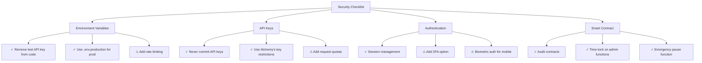
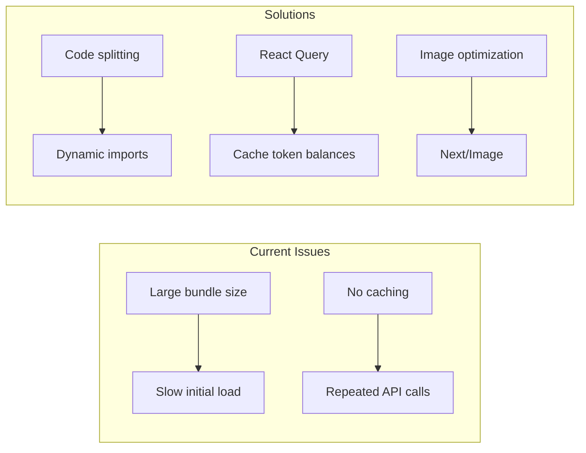
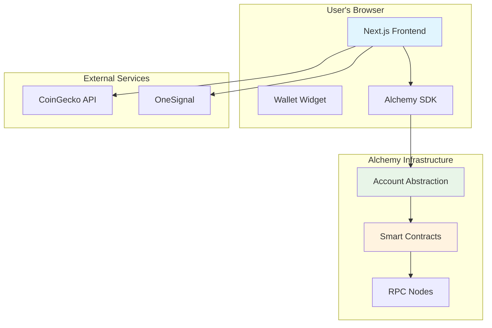

# Zam Wallet - Pre-Launch Analysis & Recommendations

## Executive Summary

Your Zam Wallet Web3 application is built on **Next.js 14** with **Alchemy Account Kit** for smart wallet functionality. Currently, it uses a **serverless architecture** (no database required for core functionality) since user wallets and data are managed by Alchemy's infrastructure.

---

## Do You Need a Database?

### Short Answer: **Not Required for Core Functionality**

Your wallet app can work without a traditional database because:

1. **User wallets are managed by Alchemy** - Smart accounts (LightAccount) are created and stored on Alchemy's infrastructure
2. **Token balances are fetched on-chain** - Using `useTokenBalances` hook that queries blockchain directly
3. **Transaction history is read from blockchain** - No database needed to store transaction records
4. **Staking data is on-chain** - Smart contracts store all staking information

### When You Would Need a Database (Optional):

| Use Case | Database Need | Purpose |
|----------|---------------|---------|
| User profiles/preferences | Optional | Store display names, settings |
| KYC verification | Optional | Store identity documents |
| Fiat on/off ramp | Optional | Store transaction records |
| Push notifications | Optional | Store device tokens |
| Analytics | Optional | Track user behavior |
| Support tickets | Optional | Customer support system |

### Recommended Database (If Needed Later):

For your VPN/cPanel deployment, consider:
- **PostgreSQL** (via Supabase or Neon) - Best for structured data
- **MongoDB** - Good for flexible schemas
- **Redis** - For caching and session management

---

## Critical Improvements Before Launch

### 1. Security Enhancements 🔴 HIGH PRIORITY



**Required Actions:**
- [ ] **Remove hardcoded API key** from `.env.local` - get a production key from Alchemy
- [ ] Set up **API key restrictions** in Alchemy dashboard (allowed domains, rate limits)
- [ ] Enable **CORS restrictions** on Alchemy API
- [ ] Add **rate limiting** to prevent abuse

### 2. Smart Contract Audits 🔴 HIGH PRIORITY

Your contracts need professional auditing:
- **ZAMD Staking** contract handles user funds
- **ZAMD Token** is an ERC-20

**Recommended Auditors:**
1. Hacken
2. CertiK
3. Trail of Bits
4. OpenZeppelin

### 3. Performance Optimization 🟡 MEDIUM PRIORITY



**Recommended Changes:**
- [ ] Add **React Query caching** for token balances (reduce API calls)
- [ ] Implement **dynamic imports** for heavy components
- [ ] Use **Next/Image** for optimized images
- [ ] Add **service worker** for offline support
- [ ] Implement **lazy loading** for swap/earn features

### 4. User Experience Improvements 🟡 MEDIUM PRIORITY

| Feature | Current State | Recommended |
|---------|---------------|-------------|
| Transaction confirmations | Basic | Add step-by-step confirmation with gas estimation |
| Network switching | Manual | Auto-detect & prompt switch |
| Error handling | Generic | User-friendly messages with recovery suggestions |
| Loading states | Spinners | Skeleton screens |
| Empty states | None | Helpful onboarding prompts |

### 5. Feature Completions 🟢 LOW PRIORITY

| Feature | Status | Notes |
|---------|--------|-------|
| Buy Crypto (Fiat) | ❌ Missing | Need integration (Ramp, Transak, MoonPay) |
| Sell Crypto (Fiat) | ❌ Missing | Need integration |
| iOS App | Coming Soon | Already in UI |
| Android APK | ✅ Ready | Already in UI |
| Push Notifications | ⚠️ Partial | OneSignal configured but needs testing |

### 6. Legal & Compliance 🟡 MEDIUM PRIORITY

Before launch, ensure:
- [ ] **Terms of Service** - Legal protection
- [ ] **Privacy Policy** - GDPR compliance
- [ ] **Risk Disclosures** - Crypto investment warnings
- [ ] **KYC/AML Policy** - If offering fiat on/off ramp
- [ ] **Cookie Consent** - For analytics (OneSignal)

---

## Deployment Recommendations for WHM/cPanel

### Option 1: Node.js App (Recommended for Next.js)

```
Requirements:
- Node.js 18+ 
- PM2 for process management
- Nginx as reverse proxy
```

**Setup Steps:**
1. Build the app: `npm run build`
2. Start with PM2: `pm2 start npm --name "zam-wallet" -- start`
3. Configure Nginx reverse proxy to port 3000
4. Set up SSL with Let's Encrypt

### Option 2: Static Export (Limited Functionality)

```bash
# In next.config.mjs
const nextConfig = {
  output: 'export',
  // Some features won't work (API routes)
}
```

**⚠ Warning:** Static export breaks:
- Server-side authentication
- API routes for price feeds
- Dynamic wallet operations

### Environment Variables for Production

Create `.env.production`:

```env
# Alchemy - GET NEW PRODUCTION KEYS
NEXT_PUBLIC_ALCHEMY_API_KEY=your_production_api_key
NEXT_PUBLIC_ALCHEMY_POLICY_ID=your_production_policy_id

# App URL
NEXT_PUBLIC_APP_URL=https://web.zamwallet.xyz

# Optional: Analytics
NEXT_PUBLIC_GA_MEASUREMENT_ID=G-XXXXXXXXXX

# Optional: Support
NEXT_PUBLIC_SUPPORT_EMAIL=support@zamwallet.xyz
```

---

## Launch Checklist

### Week 1: Security & Testing
- [ ] Get production Alchemy API keys
- [ ] Set up API key restrictions
- [ ] Complete smart contract audit
- [ ] Security penetration testing

### Week 2: Performance & UX
- [ ] Implement caching layer
- [ ] Add skeleton loading states
- [ ] Improve error messages
- [ ] Mobile responsive testing

### Week 3: Features & Compliance
- [ ] Add Terms of Service & Privacy Policy
- [ ] Set up OneSignal push notifications
- [ ] Test all wallet operations
- [ ] Fiat on-ramp integration (optional)

### Week 4: Launch
- [ ] Deploy to production server
- [ ] Set up monitoring & alerts
- [ ] Configure SSL/HTTPS
- [ ] Announce launch

---

## Cost Estimates

### Alchemy (Required)
- **Free Tier**: 300K compute units/month
- **Growth**: $49/month (if > 10K users)
- **Scale**: Custom pricing

### Hosting (WHM/cPanel)
- Already have: VPN, WHM, cPanel
- Add: $5-20/month for Node.js hosting if not included

### Optional Services
| Service | Cost | Purpose |
|---------|------|---------|
| OneSignal (Push) | Free up to 30K | Push notifications |
| Google Analytics | Free | Usage analytics |
| Domain SSL | Free (Let's Encrypt) | HTTPS |
| Email Support | $0-50/month | Customer support |

---

## Architecture Diagram



---

## Summary

**Database: Not required** for core wallet functionality. Your app uses Alchemy's infrastructure for wallet management and blockchain for data storage.

**Immediate priorities:**
1. Get production API keys (currently using test key)
2. Complete smart contract audit
3. Add legal pages (Terms, Privacy)
4. Performance optimization
5. Comprehensive testing

**Your app is ~80% ready for launch** - core functionality works, needs polish and security hardening before going live.
